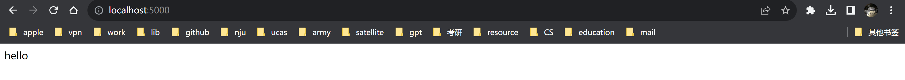

app.py

```python
import time
from flask import Flask

app = Flask(__name__)

@app.route('/')
def hello():
    return "hello"
```

docker-compose.yml

```yaml
version: '3'                    #可以看成一个json文件
services:                       #服务
  web:                          #服务名称
    container_name: flask_demo  #启动后容器名称
    build: .                    #使用当前目构建镜像
    ports:                      #端口
     - "5000:5000"              #看陈一个数组
```

Dockerfile

```dockerfile
FROM python:3.8
WORKDIR /code
ENV FLASK_APP app.py
ENV FLASK_RUN_HOST 0.0.0.0
COPY requirements.txt requirements.txt
RUN pip install -r requirements.txt -i https://pypi.tuna.tsinghua.edu.cn/simple
COPY . .
CMD ["flask", "run"]
```

requirements.txt

```
flask
```

command

```shell
matrix@DESKTOP-2IPL1MC:~$ docker-compose --version
Docker Compose version v2.20.1
matrix@DESKTOP-2IPL1MC:composetest$ docker-compose up -d
[+] Running 1/1
 ✔ Container flask_demo  Started
matrix@DESKTOP-2IPL1MC:composetest$ docker-compose logs --tail=100 -f web
flask_demo  |  * Serving Flask app 'app.py'
flask_demo  |  * Debug mode: off
flask_demo  | WARNING: This is a development server. Do not use it in a production deployment. Use a production WSGI server instead.
flask_demo  |  * Running on all addresses (0.0.0.0)
flask_demo  |  * Running on http://127.0.0.1:5000
flask_demo  |  * Running on http://172.18.0.2:5000
flask_demo  | Press CTRL+C to quit
^Ccanceled
matrix@DESKTOP-2IPL1MC:composetest$ ^C
matrix@DESKTOP-2IPL1MC:composetest$ docker-compose stop web
[+] Stopping 1/1
 ✔ Container flask_demo  Stopped                                                                                                              10.6s
matrix@DESKTOP-2IPL1MC:composetest$ docker-compose ps -a
NAME                IMAGE               COMMAND             SERVICE             CREATED             STATUS                        PORTS
flask_demo          composetest-web     "flask run"         web                 7 minutes ago       Exited (137) 16 seconds ago
```

