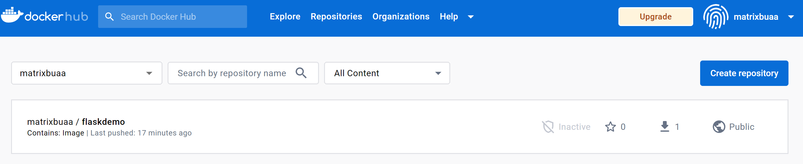

```shell
matrix@DESKTOP-2IPL1MC:~$ docker login --username matrixbuaa --password *************
WARNING! Using --password via the CLI is insecure. Use --password-stdin.
WARNING! Your password will be stored unencrypted in /home/matrix/.docker/config.json.
Configure a credential helper to remove this warning. See
https://docs.docker.com/engine/reference/commandline/login/#credentials-store

Login Succeeded
matrix@DESKTOP-2IPL1MC:~$ docker pull 192.168.0.112:8888/cicd/nginx-ingress-controller@sha256:4f5df867e9367f76acfc39a0f85487dc63526e27735fa82fc57d6a652bafbbf6^C
matrix@DESKTOP-2IPL1MC:~$ ls
flask_demo  gpg:Zone.Identifier  myip
matrix@DESKTOP-2IPL1MC:~$ docker images
REPOSITORY   TAG       IMAGE ID       CREATED        SIZE
flaskdemo    lky       4564f8c87b56   39 hours ago   978MB
matrix@DESKTOP-2IPL1MC:~$ docker tag 4564 matrixbuaa/flaskdemo:lky
matrix@DESKTOP-2IPL1MC:~$ docker images
REPOSITORY             TAG       IMAGE ID       CREATED        SIZE
flaskdemo              lky       4564f8c87b56   39 hours ago   978MB
matrixbuaa/flaskdemo   lky       4564f8c87b56   39 hours ago   978MB
matrix@DESKTOP-2IPL1MC:~$ docker push matrixbuaa/flaskdemo
Using default tag: latest
The push refers to repository [docker.io/matrixbuaa/flaskdemo]
tag does not exist: matrixbuaa/flaskdemo:latest
matrix@DESKTOP-2IPL1MC:~$ docker push matrixbuaa/flaskdemo:lky
The push refers to repository [docker.io/matrixbuaa/flaskdemo]
779215882e72: Pushed
493e084e4cba: Pushed
c2d4f22c9431: Pushed
10bfc4cb3f24: Pushed
2a68864ae1b0: Pushed
d09836256ed7: Mounted from library/python
984d2bf694d9: Mounted from library/python
5e2d6061e5d9: Mounted from library/python
aedcb370b058: Mounted from library/python
c3a0d593ed24: Mounted from library/python
26a504e63be4: Mounted from library/python
8bf42db0de72: Mounted from library/python
31892cc314cb: Mounted from library/python
11936051f93b: Mounted from library/python
lky: digest: sha256:dcbe2a361e94d2faec89ff035b19fc614f24f5a029ff73fc6c1dceb6c7823899 size: 3265
matrix@DESKTOP-2IPL1MC:~$ docker images
REPOSITORY             TAG       IMAGE ID       CREATED        SIZE
matrixbuaa/flaskdemo   lky       4564f8c87b56   39 hours ago   978MB
flaskdemo              lky       4564f8c87b56   39 hours ago   978MB
matrix@DESKTOP-2IPL1MC:~$ docker image rm $(docker image ls -aq)
Error response from daemon: conflict: unable to delete 4564f8c87b56 (must be forced) - image is referenced in multiple repositories
Error response from daemon: conflict: unable to delete 4564f8c87b56 (must be forced) - image is referenced in multiple repositories
matrix@DESKTOP-2IPL1MC:~$ docker image rm matrixbuaa/flaskdemo:lky
Untagged: matrixbuaa/flaskdemo:lky
Untagged: matrixbuaa/flaskdemo@sha256:dcbe2a361e94d2faec89ff035b19fc614f24f5a029ff73fc6c1dceb6c7823899
matrix@DESKTOP-2IPL1MC:~$ docker image rm flaskdemo:lky
Untagged: flaskdemo:lky
Deleted: sha256:4564f8c87b562e6fcafc75f769ea454a64a303caa035e10fe73caf3796545c11
matrix@DESKTOP-2IPL1MC:~$ docker images
REPOSITORY   TAG       IMAGE ID   CREATED   SIZE
matrix@DESKTOP-2IPL1MC:~$ docker pull matrixbuaa/flaskdemo:lky
lky: Pulling from matrixbuaa/flaskdemo
0e29546d541c: Already exists
9b829c73b52b: Already exists
cb5b7ae36172: Already exists
6494e4811622: Already exists
6f9f74896dfa: Already exists
fcb6d5f7c986: Already exists
35b0d149a82c: Already exists
700a07047b6b: Already exists
793b1b0c3ddf: Already exists
5d2df0426024: Already exists
7aa7f9186754: Already exists
ed8b1501e901: Already exists
78c9e6d7dab9: Already exists
27e34c1aadbe: Already exists
Digest: sha256:dcbe2a361e94d2faec89ff035b19fc614f24f5a029ff73fc6c1dceb6c7823899
Status: Downloaded newer image for matrixbuaa/flaskdemo:lky
docker.io/matrixbuaa/flaskdemo:lky
```

